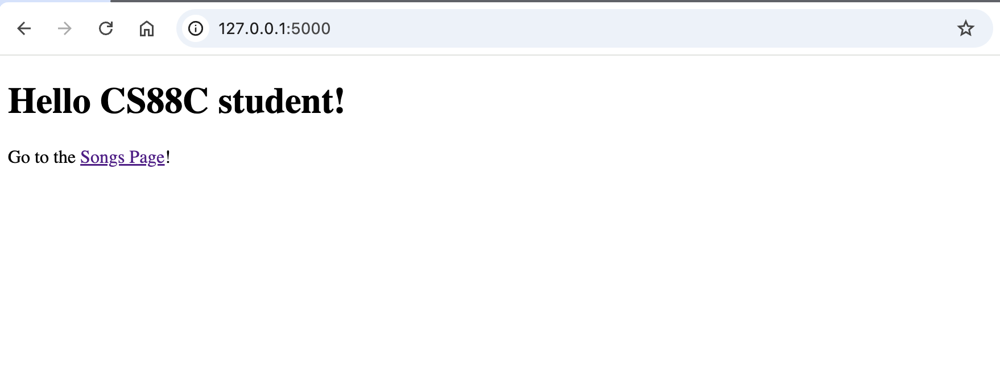

# We have Spotify at home

## Background

In this project, you will create a full-stack web application to create a feature similar to Spotify's *Daylist* feature, a daily customized music playlist. A "tech stack" is the set of technologies you use in order to complete a projects, such as programming languages and libraries. Full stack projects use technologies for all different kinds of applications, hence the name "full stack".

We'll introduce a lot of new vocabulary throughout this project, including the term *frontend* which refers to the side of the website the user sees. Our frontend is in the `project/flask_app_starter/templates` directory and is written in HTML (Hypertext Markup Language) and CSS (Cascading Style Sheets). HTML creates the layout of the webpage and CSS styles the page by customizing things such as font, colors, and font size. Everything that the user *can't* see is considered *backend*; things like OOP class designs, databases, and data manipulation are things that the user doesn't see when they visit a webpage. The backend of this project is written in Python using the [Flask](https://flask.palletsprojects.com/en/stable/) framework and is available in `project/flask_app_starter`.

For this project we will ask you to utilize knowledge you've acquired through different parts of this course. Our song database is a *SQL Table* and the code we use to construct the database is in `db.py`. For now, don't worry about this code. Instead, read through `schema.sql` to familiarize yourself with the structure of the SQL table called `songs` we'll be using.

The code that sets up our website lives in `project/flask_app_starter/__init__.py`. Just like how a class in Python needs to be initialized before you can use it, our web app also needs to be initialized before it can run. It is not super important for you to understand everything in this file, but what you should know is that it:

- Defines a function `create_app` which configures and returns the Flask web application we are writing
- Initializes the `songs` [SQLite](https://docs.python.org/3/library/sqlite3.html) database
- Registers Flask [*Blueprints*](https://flask.palletsprojects.com/en/stable/tutorial/views/) which are ways to organize related code of your Flask app

## Task 0: Setup

Follow the instructions below to setup your development environment locally.

### MacOS

1. Setup a virtual environment: `python3 -m venv .venv`
2. Activate the virtual environment: `. .venv/bin/activate`
3. Install dependencies: `pip install -r requirements.txt`
4. Initialize the database:
```sh
cd project/flask_app_starter
flask --app __init__.py init-db
```

### Windows

1. Setup a virtual environment: `py -3 -m venv .venv`
2. Activate the virtual environment: `.venv\Scripts\activate`
3. Install dependencies: `pip install -r requirements.txt`
4. Initialize the database:
```
cd project\flask_app_starter
flask --app __init__.py init-db
```

### Running the web app locally

```sh
cd project/flask_app_starter
flask --app __init__.py --debug run
```

Then go to [http://127.0.0.1:5000](http://127.0.0.1:5000) to view the web app!
You should see something like this if everything works properly:



You can keep this local web server running as you work on the project. Whenever you want to quit the server, press `Ctrl + C`.

> Note: It is important to pass the `--debug` command line flag so that any changes you make to the code will appear automatically as the app runs. If you do not include that flag, if you make a change in your code it will not be reflected until you quit the app and restart it.

## Blueprints and Routes

The `project/flask_app_starter/main.py` and `project/flask_app_starter/api.py` files define the `main` and `api` Blueprints, respectively. Each of these files contains functions which define *routes* that correspond to different pages on the website (in the case of the `main` Blueprint) or different *API* endpoints on the website (in the case of the `api` Blueprint).

**What is a route?** A route is a URL path that is used to navigate to different parts of the website. For example, assuming you have the web app running, you can navigate to [http://127.0.0.1:5000/songs](http://127.0.0.1:5000/songs) to view the songs page. The logic for what is displayed on this page is defined in `project/flask_app_starter/main.py` in the function below `@bp.route('/songs')`. Notice that it:

1. Selects all songs from the `songs` table.
2. Calls the `render_template` function from the `flask` module. This renders the `songs.html` HTML template in `project/flask_app_starter/templates/songs.html`.
3. The `songs.html` template then iterates over the songs passed to it through `main.py`.

> Note: The `@` syntax is called a Python [decorator](https://docs.python.org/3/glossary.html#term-decorator); for this project it is not important for you to fully understand what this is -- instead just remember we use decorators in Flask to define routes.

**What is an API?** API stands for *Application Programming Interface*. It is a way for programmers to retrieve and send information using code. A good analogy for APIs is how a restaurant works: The customer orders food and drink through the server. The server is the person who actually interfaces with the chefs, who fulfill the orders. The customer is like the user or programmer, the server is the API, and the chefs are the backend system (e.g. the database).

In the context of web applications, APIs are typically described by a combination of an [HTTP request method (aka "HTTP verb")](https://developer.mozilla.org/en-US/docs/Web/HTTP/Reference/Methods) and a route. For example, a web app might have a `GET /api/users` endpoint that returns a [JSON](https://en.wikipedia.org/wiki/JSON) object containing information about all of its users.

API endpoints can also take in *query parameters* through their URL. Query parameters are added to a URL like so:

```
GET /api/endpoint?param1=value1&param2=value2
```

Notice that the query parameters come in key-value pairs (`param1` has value `value1`, `param2` has value `value2`) after the endpoint. Query parameter pairs start with `?` and are separated by `&`. For example, `GET /api/users?id=12345` could be used to retrieve information about the user with ID 12345.

When the user/programmer uses the API, this is called making a *request*. Then, the web server will give data back to them, which is called a *response*. Responses typically come in the format of a JSON object (which is very similar to a dictionary in Python) and an [HTTP status code](https://developer.mozilla.org/en-US/docs/Web/HTTP/Reference/Status) indicating the status of the response. Here are some common status codes:

| Status Code | Name | Description |
| :--- | :--- | :--- |
| 200 | OK | Request successful |
| 400 | BAD REQUEST | Something went wrong on the user/programmer's side, e.g. they provided bad input parameters |
| 404 | NOT FOUND | The resource the user/programmer requested is not found in the backend |

## Task 1: `GET /api/track-image` endpoint

Let's make our own API endpoint! Open the `project/flask_app_starter/api.py` file. We've provided some skeleton code for you to implement the `track_image` function which defines the behavior for the `GET /api/track-image` endpoint. (You are free to modify the body of the `track_image` function as you wish.)

### Request query parameters

- `artist` (`str`): Artist name
- `title` (`str`): Song title

Example URL you can copy and paste into your browser to test your application where `artist` is `Taylor Swift` and `title` is `Elizabeth Taylor` (note that we need to encode spaces as a special combination of characters, `%20`):

```
http://127.0.0.1:5000/api/track-image?artist=Taylor%20Swift&title=Elizabeth%20Taylor
```

### Response format

If querying the database successfully returns a row, respond with a  JSON object with artist name, song title, and album cover image URL and status `200 OK`.

Example JSON output with dummy data:

```json
{
    "artist": "Taylor Swift",
    "title": "Elizabeth Taylor",
    "image_url": "https://example.jpg"
}
```

### Error handling

A robust web API should also handle errors! Your implementation should explicitly handle the following:

1. If the user does not provide both the `artist` AND `title` query parameters, respond with status `400 BAD REQUEST` and this JSON:

```json
{
    "status": "error",
    "message": "Artist name and/or song title not provided as query arguments, both are required",
}
```

2. If the user provides an `artist` and `title` but the database query returns no rows, respond with status `404 NOT FOUND` and this JSON (replacing `{artist}` and `{title}` with their actual values):

```json
{
    "status": "error",
    "message": "Track image for artist {artist} and song title {title} not found",
}
```

### Resources

An important part of this project is learning how to work like a real software engineer, which involves doing your own research on how different coding libraries and frameworks work! Below are links to documentation that you may find useful as you implement this API endpoint.

- Flask documentation
    - [Routing](https://flask.palletsprojects.com/en/stable/quickstart/#routing)
    - [Accessing request data](https://flask.palletsprojects.com/en/stable/quickstart/#accessing-request-data)
    - [APIs with JSON](https://flask.palletsprojects.com/en/stable/quickstart/#apis-with-json)
- `sqlite3` documentation
    - [`execute` method](https://docs.python.org/3/library/sqlite3.html#sqlite3.Cursor.execute)
    - [`fetchone` method](https://docs.python.org/3/library/sqlite3.html#sqlite3.Cursor.fetchone)
    - [`sqlite3.Row`](https://docs.python.org/3/library/sqlite3.html#row-objects) and [how to create and use row factories](https://docs.python.org/3/library/sqlite3.html#sqlite3-howto-row-factory)
        - **Note:** We have setup the database in this application so that it uses a [SQLite Row Factory](https://docs.python.org/3/library/sqlite3.html#sqlite3.Connection.row_factory), which means that when you execute a query and fetch its results, it will be 1 or more `Row` objects.
- `http` module documentation
    - [`HTTPStatus`](https://docs.python.org/3/library/http.html#http-status-codes) (a class that defines the HTTP status codes so you don't have to hardcode numbers)

**Hint 1:** In order to check if a user has provided the 2 required query parameters, it will help to set a default dummy value for the `artist_name` and `song_title` variables. There is a way to do this using Flask's `request.args.get` method.

**Hint 2:** For the SQL query you need to write in the `query` variable, you can use a multi-line Python string enclosed in triple quotes, e.g.:

```py
query = """
        SELECT ...
        FROM ...
        WHERE ...
        """
```

**Hint 3:** In order to *securely* pass the values of variables into a SQL query, make sure you use [placeholders](https://docs.python.org/3/library/sqlite3.html#sqlite3-placeholders). If you are following the starter code, you will want to use the `?` placeholder for the artist name and song title, which are already passed in as a tuple of query parameters in the line:

```py
row = database.execute(query, (artist_name, song_title)).fetchone()
```

### Tests

To test your implementation, run the following command from the `project` directory:

```sh
pytest tests/test_api.py
```

## Running unit tests

Unit tests are located in the `project/tests` directory and are run using [pytest](https://docs.pytest.org/en/stable/).

```sh
cd project

# Run all unit tests
pytest

# Run tests in a specific file
pytest path/to/file.py
```
