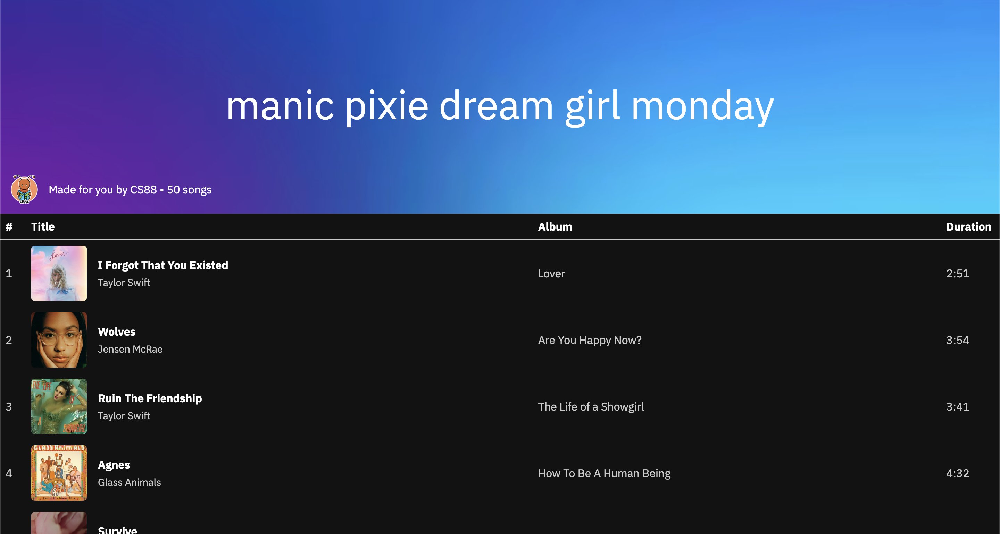
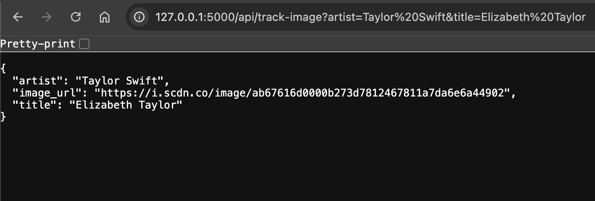

# We have Spotify at home

- [We have Spotify at home](#we-have-spotify-at-home)
    - [Background](#background)
    - [`songs` table schema](#songs-table-schema)
    - [Being a software engineer](#being-a-software-engineer)
    - [Task 0: Setup](#task-0-setup)
        - [Running the web app locally](#running-the-web-app-locally)
    - [Data Access Object](#data-access-object)
    - [Task 1A: Object Oriented Design](#task-1a-object-oriented-design)
    - [Task 1B: Object Oriented Implementation](#task-1b-object-oriented-implementation)
        - [Resources](#resources)
        - [Tests](#tests)
    - [Blueprints and Routes](#blueprints-and-routes)
    - [Task 2: `GET /api/track-image` endpoint](#task-2-get-apitrack-image-endpoint)
        - [Request query parameters](#request-query-parameters)
        - [Response format](#response-format)
        - [Error handling](#error-handling)
        - [Resources](#resources-1)
        - [Tests](#tests-1)
    - [Task 3: `GET /api/daylist` endpoint](#task-3-get-apidaylist-endpoint)
        - [Request query parameters](#request-query-parameters-1)
        - [Response format](#response-format-1)
        - [Resources](#resources-2)
        - [Tests](#tests-2)
        - [View Your Daylist](#view-your-daylist)
    - [Running unit tests](#running-unit-tests)
    - [Resources](#resources-3)


## Background

In this project, you will create a *full stack web application* similar to Spotify's [Daylist](https://newsroom.spotify.com/2023-09-12/ever-changing-playlist-daylist-music-for-all-day/) feature, a daily customized music playlist:



A *tech stack* is the set of technologies you use in order to implement a piece of software, such as the programming languages and libraries needed. A *full stack* project involves technologies for both the *frontend* (the user-facing part of the website) and *backend* (the behind-the-scenes part of the website).

Our frontend is in the `daylist/templates` directory and is written in HTML (Hypertext Markup Language) and CSS (Cascading Style Sheets). HTML creates the layout and content of the webpage and CSS styles the page by customizing things such as font, colors, and font size.

Everything that the user *can't* see is considered *backend*; things like OOP class designs, databases, and data manipulation are things that the user doesn't see when they visit a webpage. The backend of this project is written in Python using the [Flask](https://flask.palletsprojects.com/en/stable/) framework and can be found in `daylist`.

For this project we will ask you to utilize knowledge you've acquired through different parts of this course, such as Python functions, data structures, and control statements, as well as SQL.

## `songs` table schema

We have a database of 100 songs stored in a *SQL table*. The code we use to construct the database is in `daylist/db.py`. You don't need to worry about this code, but you should read through `daylist/schema.sql` to familiarize yourself with the structure of the SQL table called `songs` we'll be using. Here are the columns in our SQL table:

| Column             | Data Type   | Description                                           |
| ------------------ | ----------- | ----------------------------------------------------- |
| `id`               | `INTEGER`   | Unique ID for each song, specific to our database.    |
| `song_link`        | `TEXT`      | URL of the song on Spotify                            |
| `song_id`          | `TEXT`      | Unique ID for each song, used by the Spotify platform |
| `track_name`       | `TEXT`      | Song title                                            |
| `artist_name`      | `TEXT`      | Artist name                                           |
| `album_name`       | `TEXT`      | Name of album the song is from                        |
| `album_image_url`  | `TEXT`      | Image URL of the album the song is from               |
| `duration`         | `FLOAT`     | Duration of the song in seconds                       |

The code that sets up our website lives in `daylist/__init__.py`. Just like how a class in Python needs to be initialized before you can use it, our web app also needs to be initialized before it can run. It is not super important for you to understand everything in this file, but what you should know is that it:

- Defines a function `create_app` which configures and returns the Flask web application we are writing
- Initializes the `songs` [SQLite](https://docs.python.org/3/library/sqlite3.html) database
- Registers Flask [*Blueprints*](https://flask.palletsprojects.com/en/stable/tutorial/views/) which are ways to organize related code of your Flask app

## Being a software engineer

An important part of this project is learning how to work like a real software engineer, which involves doing your own research on how different coding libraries and frameworks work! As you work on the project, be sure to consult the [Resources](#resources) section, which contains links to documentation that you may find useful.

## Task 0: Setup

Follow the instructions below to setup your development environment locally.

1. Install [uv](https://docs.astral.sh/uv/getting-started/installation/), a cross-platform command line interface (CLI) to manage Python projects, versions, and dependencies. You can install `uv` however you wish but we recommend using the standalone installer by running one of these commands depending on your operating system:
    - MacOS or Unix:

    ```sh
    curl -LsSf https://astral.sh/uv/install.sh | sh
    ```

    - Windows (run this in PowerShell):

    ```ps
    powershell -ExecutionPolicy ByPass -c "irm https://astral.sh/uv/install.ps1 | iex"
    ```

    > [!NOTE]
    > A CLI is a program that you can run in your terminal by using different commands.

2. Setup your [virtual environment](https://docs.python.org/3/library/venv.html) and initialize your app's database:

```sh
uv run flask --app daylist init-db
```

Verify that:

- You have a new directory called `.venv` (this is your virtual environment)
- You have a new directory called `instance` (this contains your database)

**You can ignore the contents of these directories and you should NOT modify them.**

> [!NOTE]
> Professional software projects often use a *virtual environment* in order to manage
> the different programming language and dependency versions required for the software
> to work. In our case, we use `uv` in order to ensure that we are using the correct
> version of Python (the one specified in the `.python-version` file) and the
> correct versions of our project dependencies (specified in `pyproject.toml`).

> [!TIP]
> The `uv` tool will automatically ensure that you are using and have installed the
> correct dependencies when you prefix commands with `uv run`.
> You do not need to activate your virtual environment, but you may if you wish
> and in that case you do not need to prefix commands with `uv run`.

> [!TIP]
> You may see directories called `__pycache__` as you run Python commands.
> You can ignore these directories and you should NOT modify them.

### Running the web app locally

```sh
uv run flask --app daylist --debug run
```

Then go to [http://127.0.0.1:5000](http://127.0.0.1:5000) to view the web app!
You should see something like this if everything works properly:


You can keep this local web server running as you work on the project. Whenever you want to quit the server, press `Ctrl + C` in your terminal.

> [!IMPORTANT]
> You must include the `--debug` command line flag so that any changes you make to the code will appear when you refresh as the server runs. If you do not include that flag, if you make a change in your code it will not be reflected until you quit the server and restart it.

> [!NOTE]
> **What is 127.0.0.1:5000 exactly?** `127.0.0.1` is the IP address of `localhost`, which is your own computer.
> The `:5000` indicates that the app is running on port 5000.
> To learn more, take [CS 168: Computer Networking](https://cs168.io)!

## Data Access Object

Though we don't need to know *exactly* how the database is initialized in this project, we do need to access the data somehow in order to create our Daylist. To do this, we'll create a [*Data Access Object* (DAO)](https://en.wikipedia.org/wiki/Data_access_object) which will allow you to access data in the database and initialize song objects. The DAO pattern is often used in software engineering to have a layer of abstraction between the database and the backend code. For example, we may want to restrict what database operations can be performed by the backend code to avoid accidentally deleting or overwriting data. This also makes it easier to swap out database systems if we choose a different system.

## Task 1A: Object Oriented Design

In `dao.py` you will implement two classes: `DataAccessObject` and `Song`.

The `Song` class should allow you to initialize a song object. A `Song` instance must keep track of the song's title, artist name, album name, album image (which is a url), and the duration of the song (rounded to the nearest second).

The `DataAccessObject` will allow you to access the database directly and initialize song objects that you can later use. Your design must support the following methods:

- `get_all_songs(self)` : This method takes no arguments (besides `self`) and returns a list of `Songs` where each song is represented as a dictionary. For instance, if the database only contained one song, `get_all_songs` should return the list below.

> [!IMPORTANT]
> The names of the dictionary keys must be identical to the example below so that our frontend renders correctly.

> [!IMPORTANT]
> The duration stored in the database is of type `FLOAT` because it may contain fractions of a second.
> Your `get_all_songs` method should return the duration rounded to the nearest second, as an integer.

```
[
    {
        "title": "Genius",
        "artist": "Ravyn Lenae",
        "album": "Bird's Eye",
        "album_cover": "https://i.scdn.co/image/ab67616d0000b273ef985ba96e76a9574cc68a30",
        "duration": 156,
    }
]
```
- `get_song_by_title_and_artist(self, track_name, artist_name)`: Given the song title (`track_name`) and song artist (`artist_name`), return the corresponding `Song` object. If no such song exists in the database, return `None`. Assume that the combination of song title and artist will always be unique.
- `__eq__(self, other)`: The `__eq__` method is a special method that allows us to implement behavior to check whether the current `Song` object is equal to another object (`other`). It is called when the `==` operator is used on a `Song` object. It should return:
    - `True` if `other` is also `Song` object with the exact same properties
    - `False` if `other` is also `Song` object but with 1 or more **different** properties
    - `NotImplemented` if `other` is not a `Song` object

We **highly recommend** that you also implement the `__str__` and `__repr__` methods for the `Song` class so that you are able to easily visualize the representation of a song. This will especially be helpful for debugging tests. You can implement these however you wish.

> [!NOTE]
> For the `DataAccessObject`, you will need to access the underlying database, you can do this by calling `db.get_db()`. Our underlying database is a SQL table, so you will need to write a SQL query in order to fetch data.

Before implementing large, complex systems, engineers in industry and academia will often write a *design document* to outline the context of the problem they're trying to solve, their data schema/modeling, etc. This allows them to make their ideas more concrete, spot issues early on, and collaborate with others to improve their design.

To get some experience with this real-world practice, your task is to:

1. Make a copy of this [design doc template](https://docs.google.com/document/d/1fDjmX4Y9SwsItC0m_UQPmtVgq9kvGf6audSEduDCJg8/edit?usp=sharing) and fill it out.
2. Export the Google Doc to a PDF and submit it to the relevant Gradescope assignment.

## Task 1B: Object Oriented Implementation

Implement the classes and methods you described in Task 1A by completing `dao.py`.

> [!IMPORTANT]
> Do not delete any of the starter code; only add on to it. This ensures your methods are in the correct
> format so that the autograder tests will work.

> [!TIP]
> Python has a built-in `round` function that will round a float to the nearest integer:

```py
>>> round(5.5)
6
>>> round(3.2)
3
>>> round(9.7)
10
```

> [!TIP]
> When writing a SQL query (setting the `query` variable), you can use a multi-line Python string enclosed in triple quotes, e.g.:

```py
query = """
        SELECT ...
        FROM ...
        WHERE ...
        """
```

> [!TIP]
> Python has a built-in `type` function that you can use to check the data type of some object:

```py
>>> type(5) is int
True
>>> type(103.32) is str
False
```

<!-- TODO update based on new dao tests -->

> [!IMPORTANT]
> In order to prevent [SQL injection attacks](https://en.wikipedia.org/wiki/SQL_injection), you should pass the values of variables into a SQL query using [placeholders](https://docs.python.org/3/library/sqlite3.html#sqlite3-placeholders). If you are following the starter code, you will want to use the `?` placeholder for the artist name and song title, which are already passed in as a tuple of query parameters in the line:
> ```py
> row = database.execute(query, (artist_name, track_name)).fetchone()
> ```
> If you want to learn more, take [CS 161: Computer Security](https://cs161.org)!

### Resources

- **Database:** `sqlite3` documentation
    - [Tutorial](https://docs.python.org/3/library/sqlite3.html#tutorial)
    - [`Connection.execute` method](https://docs.python.org/3/library/sqlite3.html#sqlite3.Connection.execute)
    - [`fetchone` method](https://docs.python.org/3/library/sqlite3.html#sqlite3.Cursor.fetchone)
    - [`fetchall` method](https://docs.python.org/3/library/sqlite3.html#sqlite3.Cursor.fetchall)
    - [`sqlite3.Row`](https://docs.python.org/3/library/sqlite3.html#row-objects) and [how to create and use row factories](https://docs.python.org/3/library/sqlite3.html#sqlite3-howto-row-factory)
        - **Note:** We have setup the database in this application so that it uses a [SQLite Row Factory](https://docs.python.org/3/library/sqlite3.html#sqlite3.Connection.row_factory), which means that when you execute a query and fetch its results, it will be 1 or more `Row` objects.
- **OOP in Python**
    - [`__eq__` method](https://docs.python.org/3/reference/datamodel.html#object.__eq__)
    - [`__repr__` method](https://docs.python.org/3/reference/datamodel.html#object.__repr__)
    - [`__repr__` method](https://docs.python.org/3/reference/datamodel.html#object.__str__)

### Tests

To formally test your implementation, run the following command from the root directory:

```sh
uv run pytest tests/test_dao.py
```

## Blueprints and Routes

The `daylist/main.py` and `daylist/api.py` files define the `main` and `api` Blueprints, respectively. Each of these files contains functions which define *routes* that correspond to different pages on the website (in the case of the `main` Blueprint) or different *API* endpoints on the website (in the case of the `api` Blueprint).

**What is a route?** A route is a URL path that is used to navigate to different parts of the website. For example, assuming you have the web app running, you can navigate to [http://127.0.0.1:5000/songs](http://127.0.0.1:5000/songs) to view the songs page. The logic for what is displayed on this page is defined in `daylist/main.py` in the function below `@bp.route('/songs')`. Notice that it:

1. Selects all songs from the `songs` table.
2. Calls the `render_template` function from the `flask` module. This renders the `songs.html` HTML template in `daylist/templates/songs.html`.
3. The `songs.html` template then iterates over the songs passed to it through `main.py`.

> [!NOTE]
> The `@` syntax is called a Python [decorator](https://docs.python.org/3/glossary.html#term-decorator); for this project it is not important for you to fully understand what this is -- instead just remember we use decorators in Flask to define routes.

**What is an API?** API stands for *Application Programming Interface*. It is a way for programmers to retrieve and send information using code. A good analogy for APIs is how a restaurant works: The customer orders food and drink through the server. The server is the person who actually interfaces with the chefs, who fulfill the orders. The customer is like the programmer, the server is the API, and the chefs are the backend system (e.g. the database).

In the context of web applications, APIs are typically described by a combination of an [HTTP request method (aka "HTTP verb")](https://developer.mozilla.org/en-US/docs/Web/HTTP/Reference/Methods) and a route. For example, a web app might have a `GET /api/users` endpoint that returns a [JSON](https://en.wikipedia.org/wiki/JSON) object containing information about all of its users. JSON is a file format that is often used to transmit data across the web. For the purposes of this project, you can treat JSON like a Python dictionary.

API endpoints can also take in *query parameters* through their URL. Query parameters are added to a URL like so:

```
GET /api/endpoint?param1=value1&param2=value2
```

Notice that the query parameters come in key-value pairs (`param1` has value `value1`, `param2` has value `value2`) after the endpoint. Query parameter pairs start with `?` and are separated by `&`. For example, `GET /api/users?id=12345` could be used to retrieve information about the user with ID 12345.

When the programmer uses the API, this is called making a *request*. Then, the web server will give data back to them, which is called a *response*. Responses typically come in the format of a JSON object and an [HTTP status code](https://developer.mozilla.org/en-US/docs/Web/HTTP/Reference/Status) indicating the status of the response. Here are some common status codes (which you will need to know for this project):

| Status Code | Name | Description |
| :--- | :--- | :--- |
| 200 | OK | Request successful |
| 400 | BAD REQUEST | Something went wrong on the programmer's side, e.g. they provided bad input parameters |
| 404 | NOT FOUND | The resource the programmer requested is not found in the backend |

## Task 2: `GET /api/track-image` endpoint

As a warmup, let's make our own API endpoint! Open the `daylist/api.py` file. We've provided some skeleton code for you to implement the `track_image` function which defines the behavior for the `GET /api/track-image` endpoint, but you are free to modify the body of the `track_image` function as you wish.

### Request query parameters

- `artist` (`str`): Artist name (required)
- `title` (`str`): Song title (required)

Here is an example URL you can copy and paste into your browser to test your application where `artist` is `Taylor Swift` and `title` is `Elizabeth Taylor` (note that we need to encode spaces as a special combination of characters, which is `%20`):

```
http://127.0.0.1:5000/api/track-image?artist=Taylor%20Swift&title=Elizabeth%20Taylor
```

### Response format

If querying the database successfully returns a row, respond with a JSON object with artist name, song title, and album cover image URL and status `200 OK`.

Example JSON output with dummy data:

```json
{
    "artist": "Taylor Swift",
    "title": "Elizabeth Taylor",
    "image_url": "https://example.jpg"
}
```

### Error handling

A robust web API should also handle errors! Your implementation should explicitly handle the following:

1. If the user does not provide both the `artist` AND `title` query parameters, respond with status `400 BAD REQUEST` and this JSON:

```json
{
    "status": "error",
    "message": "Artist name and/or song title not provided as query arguments, both are required",
}
```

> [!TIP]
> In order to check if a user has provided the 2 required query parameters, it will help to set a default dummy value for the `artist_name` and `song_title` variables. There is a way to do this using Flask's [`request.args.get`](https://flask.palletsprojects.com/en/stable/quickstart/#accessing-request-data) method.

2. If the user provides an `artist` and `title` but the database query returns no rows, respond with status `404 NOT FOUND` and this JSON (replacing `{artist}` and `{title}` with their actual values):

```json
{
    "status": "error",
    "message": "Track image for artist {artist_name} and song title {song_title} not found",
}
```

### Resources

- **Web app framework:** Flask documentation
    - [Routing](https://flask.palletsprojects.com/en/stable/quickstart/#routing)
    - [Accessing request data](https://flask.palletsprojects.com/en/stable/quickstart/#accessing-request-data)
    - [APIs with JSON](https://flask.palletsprojects.com/en/stable/quickstart/#apis-with-json)
- **HTTP status codes:** `http` module documentation
    - [`HTTPStatus`](https://docs.python.org/3/library/http.html#http-status-codes) (a class that defines the HTTP status codes so you don't have to hardcode numbers)

### Tests

To manually test your implementation:

1. Ensure your app server is [running](#running-the-web-app-locally)
2. In your browser, type in the URL to make a request. For example, you can copy and paste the example URL above and press enter.
3. You should see some plaintext JSON like so:



4. If you wish to check how your code handles errors, you can view the HTTP status codes in the logs of your Flask app in your terminal (rather than your browser).

To formally test your implementation, run the following command from the root directory:

```sh
uv run pytest tests/test_api.py -k test_track_image
```

## Task 3: `GET /api/daylist` endpoint

Now let's actually make our own Daylist by implementing another API endpoint! Open the `daylist/api.py` file. We've provided some skeleton code for you to implement the `daylist` function which defines the behavior for the `GET /api/daylist` endpoint, but you are free to modify the body of the `daylist` function as you wish.

### Request query parameters

- `seed` (`int`): A number to initialize a [pseudorandom number generator](https://en.wikipedia.org/wiki/Random_seed) so that we can reproduce random sampling of songs (optional, defaults to `DEFAULT_SEED`)

Here are some example URLs you can copy and paste into your browser to test your application (the first one uses the default seed while the second one sets the seed to 42):

```
http://127.0.0.1:5000/api/daylist
```

```
http://127.0.0.1:5000/api/daylist?seed=42
```

### Response format

Respond with a JSON object containing the playlist title, playlist cover image URL, and a playlist. The response status code should be `200 OK`.

A **playlist** is a list of `NUM_SONGS_IN_DAYLIST` songs randomly sampled from the database.

Each **song** is stored as a dictionary, which contains the following keys: song title, artist name, album, album cover image URL, and duration (rounded to the nearest second).

Example JSON output with dummy data (for brevity we only include one song in the playlist but your implementation should include more):

```json
{
    "title": "manic pixie dream girl monday",
    "image": "https://img.freepik.com/premium-photo/blue-neon-color-gradient-horizontal-background_653449-8801.jpg",
    "playlist": [
        {
            "title": "Genius",
            "artist": "Ravyn Lenae",
            "album": "Bird's Eye",
            "album_cover": "https://i.scdn.co/image/ab67616d0000b273ef985ba96e76a9574cc68a30",
            "duration": 156,
        },
        ...
    ]
}
```

> [!TIP]
> Think about how you might be able to use the `DataAccessObject` you defined in Task 1.

> [!NOTE]
> You can feel free to modify the value of `title` and `image` however
> you wish as long as the `image` is a valid image URL. Here is an [article that explains how to get an image URL through Google Images](https://support.google.com/websearch/answer/118238?hl=en&co=GENIE.Platform%3DDesktop).


### Resources

- **Web app framework:** Flask documentation
    - [Routing](https://flask.palletsprojects.com/en/stable/quickstart/#routing)
    - [Accessing request data](https://flask.palletsprojects.com/en/stable/quickstart/#accessing-request-data)
    - [APIs with JSON](https://flask.palletsprojects.com/en/stable/quickstart/#apis-with-json)
- **HTTP status codes:** `http` module documentation
    - [`HTTPStatus`](https://docs.python.org/3/library/http.html#http-status-codes) (a class that defines the HTTP status codes so you don't have to hardcode numbers)
- **Pseudorandom number generation:** `random` module documentation
    - [`random.seed`](https://docs.python.org/3/library/random.html#random.seed)
    - [`random.sample`](https://docs.python.org/3/library/random.html#random.sample)

### Tests

To manually test your implementation:

1. Ensure your app server is [running](#running-the-web-app-locally)
2. In your browser, type in the URL to make a request. For example, you can copy and paste the example URLs above and press enter.
3. You should see some plaintext JSON. Verify that it matches the specifications above.

To formally test your implementation, run the following command from the root directory:

```sh
uv run pytest tests/test_api.py -k test_daylist_playlist
```

### View Your Daylist

Once you have implemented the daylist API endpoint and all tests are passing,
you can view the fruits of your labor on the frontend!

1. Ensure your app server is [running](#running-the-web-app-locally)
2. Navigate to [http://127.0.0.1:5000/daylist](http://127.0.0.1:5000/daylist) to view your daylist
3. Refresh the page to generate a new random sample of songs

## Task 4: Use LLMs to generate a playlist title

Rather than having the same playlist `title` every time, let's generate a title based on the songs in our playlist! This is similar to the way Spotify automatically generates a title for your *Daylist*.

To generate playlist titles, we will use generative Artificial Intelligence (AI), specifically [Large Language Models (LLMs)](https://en.wikipedia.org/wiki/Large_language_model). These models are trained on large amounts of data and utilize math to find underlying patterns in the training data. Based on these patterns, models work to predict language patterns and replicate human language ("natural language"). 

There are thousands of models available for use and ways to use them. For simplicity and privacy reasons, we will be using [Ollama](https://ollama.com/), a unified platform and framework to use various LLM models for free that doesn't require an account. To get started:

1. Install the [Ollama desktop app](https://ollama.com/download).
2. Choose a model from their list of [available models](https://ollama.com/search). We recommend using `llama3.2:1b` (Llama is Meta's open-source LLM, the version is 3.2, and there are 1 billion parameters in this model). It will take up about 1.3 GB of space. You are free to try and play around with other models as well. Ollama supports "cloud" models -- we do not recommend this because it requires creating an account and you will have usage limits. (By default, Ollama models are downloaded into your computer for local use).
    - Once you've chosen a model, you can install it by clicking the download icon in the Ollama desktop app,
3. Play around with different prompts within the Ollama app. The process of iterating on different prompts to get the best output is known as *prompt engineering*. You may have experimented with this process in Task 1A when you prompted an LLM to assist in designing the `Song` and `DataAccessObject` classes. Once you have found a prompt that works well for you, save it somewhere where you can access it later. 
4. You should use the LLM to generate an adjective and a progressive verb, for instance "soulful writing" or "hopeful yearning"; you should then attach this prefix to the current time of day (for instance "monday morning"). 

> [!TIP]
> python's built in `datetime` module allows you to access the current time. See resources below for more information

Here is some starter code you can use to generate a response:

```py
response: ChatResponse = chat(
    model="YOUR SELECTED MODEL HERE",

    messages=[
        {
            "role": "user",
            "content": "YOUR PROMPT HERE",
        },
    ],
)
title_prefix = response.message.content

# This dictionary may be useful for transforming the day of the week into a string
int_to_day = ['Monday', 'Tuesday', 'Wednesday', 'Thursday', 'Friday', 'Saturday', 'Sunday']

day_of_week:str = ________

time_of_day:str = ________ #You may use multiple lines here, ensure 
title:str = ________
```


## Resources

- **LLM:** [Ollama](https://docs.ollama.com/quickstart#python)
- **Datetime:** Python `datetime` module
  - [`datetime.now` method](https://docs.python.org/3/library/datetime.html#datetime.datetime.now)
  - [`datetime.hour` attribute](https://docs.python.org/3/library/datetime.html#datetime.datetime.hour)
  - [`datetime.weekday` method](https://docs.python.org/3/library/datetime.html#datetime.datetime.weekday)

### Tests

To manually test your implementation:

1. Ensure your app server is [running](#running-the-web-app-locally)
2. In your browser, type in the URL to make a request. For example, you can copy and paste the example URLs above and press enter.
3. You should see some plaintext JSON. Verify that it matches the specifications above.

To formally test your implementation, run the following command from the root directory:

```sh
uv run pytest tests/test_api.py -k test_daylist_title
```

To visually check your implementation, follow the directions to [view your daylist](#view-your-daylist)

## Running unit tests

Unit tests are located in the `tests` directory and are run using [pytest](https://docs.pytest.org/en/stable/)
from the root directory.

> [!NOTE]
> Running tests may create a directory `.pytest_cache` which can be ignored (do NOT modify it).

```sh
# Run all unit tests
uv run pytest

# Run tests in a specific file
uv run pytest path/to/file.py

# Run tests in a specific file with particular test names
uv run pytest path/to/file.py -k test_name

# Add the -s flag to tun tests and show print output (which is hidden by default)
# You can specify a file or test name in addition to this
uv run pytest -s
```

## Resources

- **Database**: [`sqlite3` module documentation](https://docs.python.org/3/library/sqlite3.html)
- **Web app framework:** [Flask documentation](https://flask.palletsprojects.com/en/stable/)
- **HTTP status codes:** [`http` module documentation](https://docs.python.org/3/library/http.html)
- **Pseudorandom number generation:** [`random` module documentation](https://docs.python.org/3/library/random.html)
- **Build system:** [`uv` docs](https://docs.astral.sh/uv/)
- **Test system** [`pytest` docs](https://docs.pytest.org/en/stable/)
